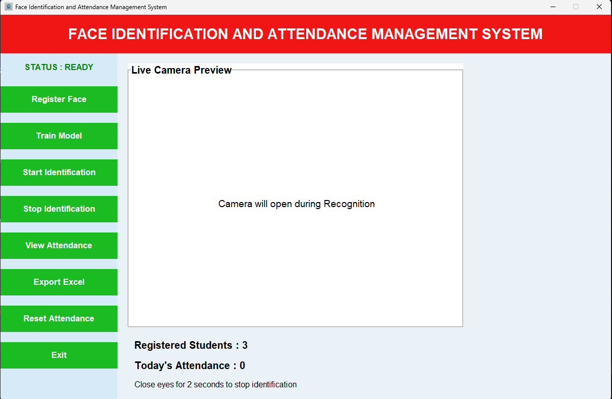
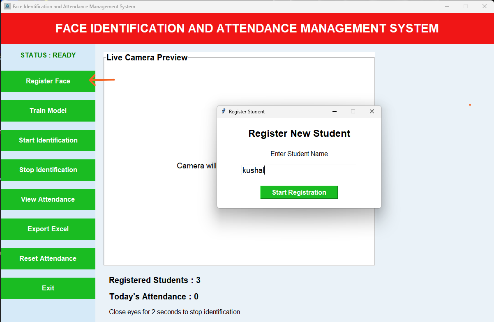
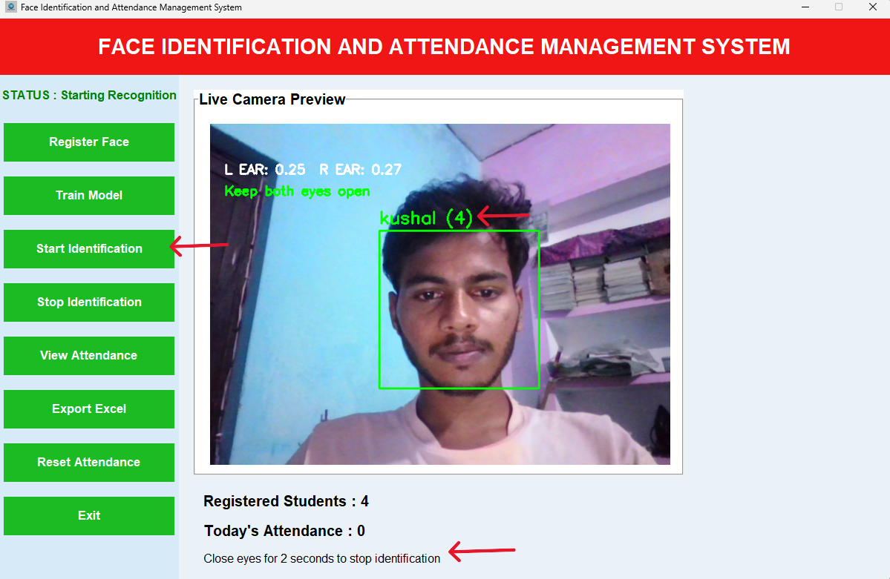
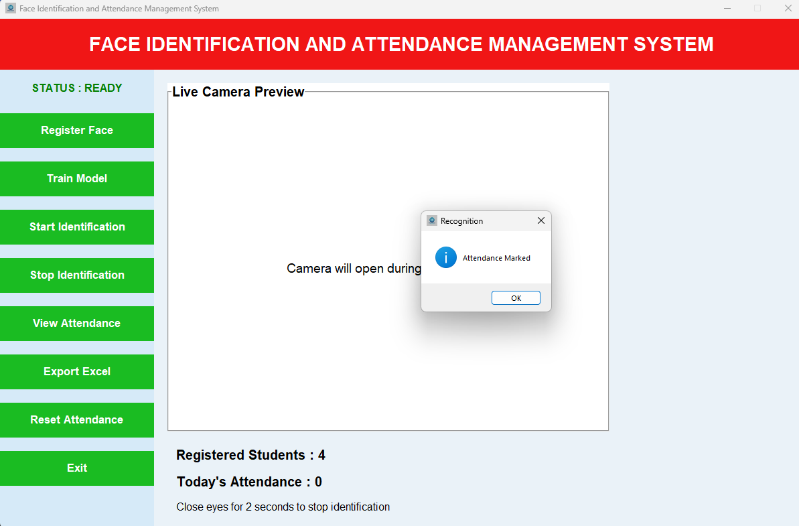
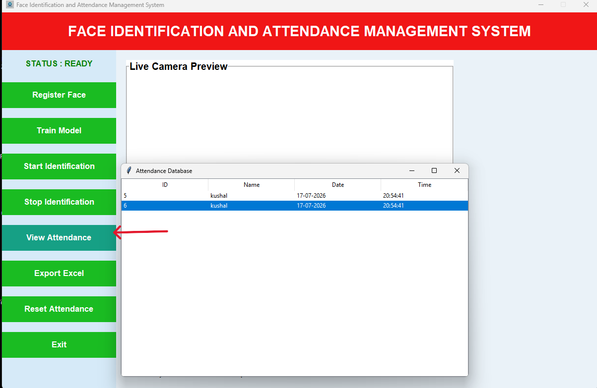
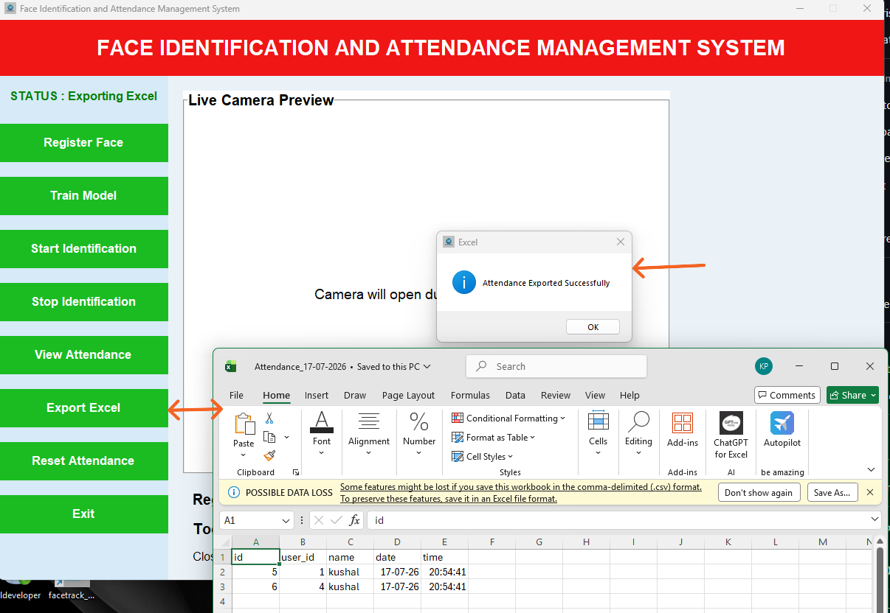
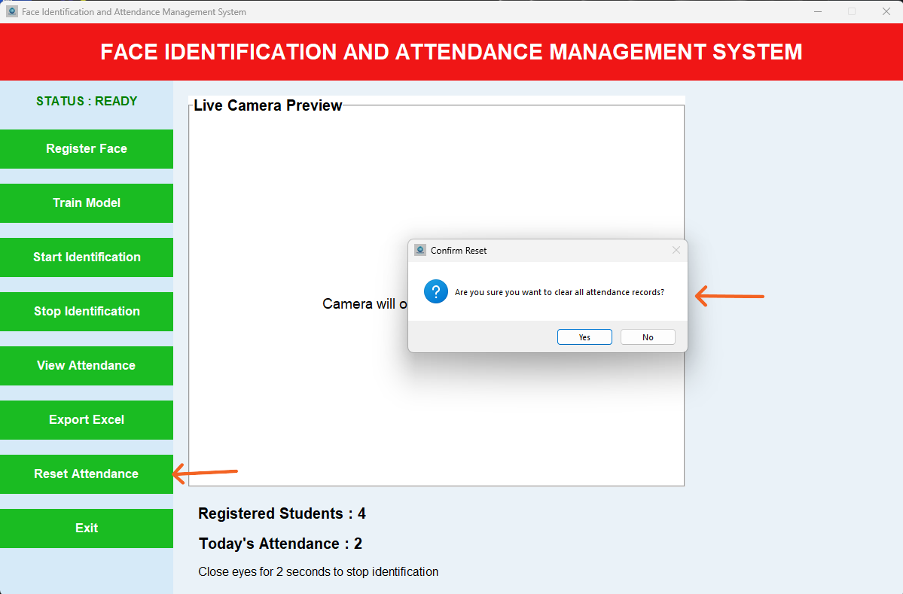
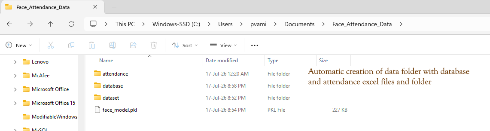

# Face Identification and Attendance Management System

<p align="center">
  
</p>

## Overview

An AI-powered desktop application developed using Python for real-time face identification and automatic attendance management.

The system allows users to register faces, train deep learning embeddings, perform real-time recognition, and generate attendance reports in Excel format.

---

## Key Features

- Face Registration Module
- Automatic Dataset Generation
- DeepFace + FaceNet Embedding Training
- Real-Time Face Identification
- Automatic Attendance Marking
- Duplicate Attendance Prevention
- Eye Blink Detection Based Exit
- Attendance Database Management
- Excel Report Generation
- Windows Installer Support

---

## Technology Stack

| Technology | Purpose |
|------------|----------|
| Python | Core Development |
| OpenCV | Face Detection |
| DeepFace | Face Recognition |
| Mediapipe | Eye Blink Detection |
| SQLite | Database |
| Tkinter | GUI |
| Pandas | Excel Reports |
| PyInstaller | EXE Generation |
| Inno Setup | Installer Creation |

---

## System Workflow

```text
Student Registration
          ↓
Dataset Creation
          ↓
Model Training
          ↓
Real-Time Recognition
          ↓
Attendance marked
          ↓
Excel Export or reset attendance 
```

---
## Project structure


`registration.py` - captures face images from the webcam and stores them in `dataset/`

`training.py` - trains embeddings from images in `dataset/` and saves `face_model.pkl`

`recognition.py` - runs real-time face recognition and marks attendance in the SQLite database

`export_excel.py` - exports attendance data to `attendance/attendance.xlsx`

`database.py` - creates the `database/face_db.db` database and required tables

`attendance/` - output folder for exported Excel files

`database/` - SQLite database files

`dataset/` - student image folders, one folder per person

`haarcascade_frontalface_default.xml` - face detector model used by registration

# Application Screenshots
## Main Dashboard



The main dashboard provides a user-friendly graphical interface for managing the complete face identification and attendance process.

### Features Available:
- Register New Student
- Train Face Recognition Model
- Start Real-Time Identification
- Stop Identification Process manually (or by closing eyes for 2 second)
- View Attendance Records
- Export Attendance to Excel
- Reset Attendance 

The dashboard acts as the central control panel of the application and allows the administrator to perform all operations from a single window.

## Student Registration



During registration, the administrator enters the student's name and initiates the registration process.

### Working Process:
1. a window opens asking for name of student
2. The webcam is activated automatically.
3. Multiple facial images are captured from different angles.
4. A separate folder is automatically created for every registered student.
5. Images are stored inside the student_name folder inside dataset folder .
6. Registration information is stored in the database.

This process helps improve recognition accuracy by collecting multiple facial samples under different facial expressions and orientations.

The administrator registers a new student by clicking register button and the system automatically captures facial images after writing name of student 

## Model Training


### Training Process:
1. Dataset images are loaded.
2. DeepFace extracts facial embeddings.
3. Embeddings are converted into numerical feature vectors.
4. The trained model is generated and saved as:
face_model.pkl

Facial embeddings are generated and stored inside the trained model.

## Real-Time Identification



This module performs live face recognition using the webcam.

### Working Process:
1. Video frames are continuously captured.
2. Faces are detected in real time.
3. DeepFace generates embeddings for detected faces.
4. Embeddings are compared with stored user embeddings.
5. The matched user's name is displayed.
6. Attendance is automatically recorded.

### Additional Features:
- Unknown person detection
- Duplicate attendance prevention
- Automatic camera handling
- Real-time processing

This provides a completely contactless attendance mechanism.


## Stopping Identification
 

The idenfication can be stopped by closing eyes for 2 second and also by clicking stop identification button 
After which it shows popup of  "Attendance Marked"

## View Attendance Records



The administrator can view attendance records directly from the application.

### Displayed Information:
- Student Name
- Date
- Time
- Attendance Status

### Features:
- Easy attendance monitoring
- Database integration
- Instant record retrieval

This module helps administrators manage attendance efficiently.

## Excel Export



Attendance records can be exported to Microsoft excel with proper date format."C:\Users\Documents\Face_Attendance_Data\attendance\Attendance_17-07-2026.csv"
### Features:
- Automatic report generation
- Date and time preservation
- Printable reports
- Easy sharing and documentation

Generated reports are useful for maintaining official attendance records.

## Reset Attendance



The system allows administrators to clear attendance records whenever required.

### Features:
- Confirmation before deletion
- Prevents accidental data loss
- Fresh attendance session creation

This functionality is useful for managing daily attendance cycles.

# Automatic Data Storage


The application automatically creates all required directories during execution.

### Generated Structure:

```text
Face_Identification_System/
│
├── dataset/
├── database/
├── attendance/
├── exports/
└── face_model.pkl
```

### Advantages:
- No manual configuration required
- Easy deployment
- Better project organization
- Simplified maintenance

This makes the application highly portable and user friendly.

# Installation

## Clone Repository

```bash
git clone https://github.com/USERNAME/Face-Identification-Attendance-System.git
```

## Install Dependencies

```bash
pip install -r requirements.txt
```

## Run Application

```bash
python src/gui.py
```

---

# Windows Installer

A professional Windows installer has been created using:

- PyInstaller
- Inno Setup

Installer can be downloaded from:

👉 Releases Section

---

# Future Enhancements

- Multi-user Authentication
- Web Dashboard
- Cloud Database
- Mobile Application
- Face Anti-Spoofing
- Attendance Analytics

---

# Project Information

**Implementation**

Implemented during industrial training at Supervisor Training Centre (STC), Northern Railway, Charbagh, Lucknow.

---

# Author

Kushal Patel

B.Tech Computer Science and Engineering

Feroze Gandhi Institute of Engineering and Technology

---

## License

This project is provided as-is for learning and personal use.
